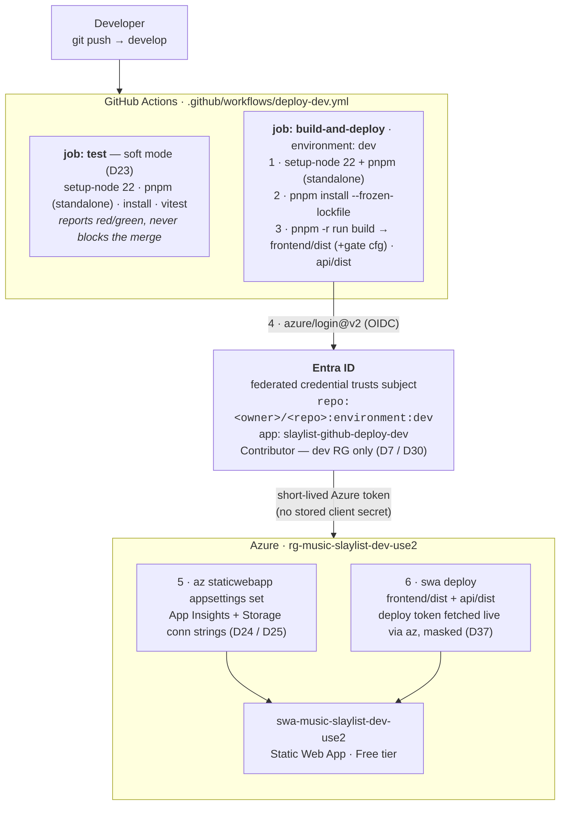
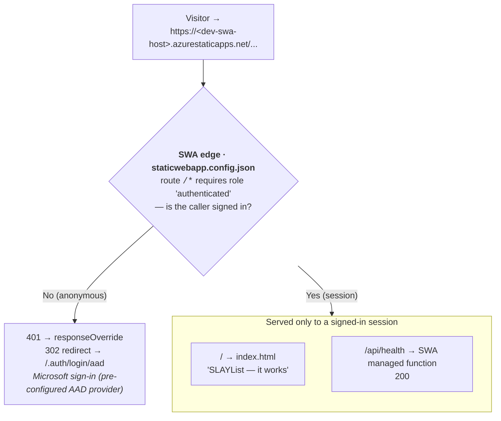

# Deployment & runtime request flow

How code gets from a `git push` to the live dev Static Web App, and what a visitor's
request actually hits once it's there.

**Lane:** `ARCHITECTURE.md` is the **system architecture** — which Azure resources exist and
why, how app data flows, the data model, dev/prod separation. **This file is the operational
layer**: the **CI/CD pipeline** (how a push becomes a deploy) and the **D22 runtime auth gate**
(how a live request is handled). Rule of thumb for the one overlap — the `develop`→dev /
`main`→prod mapping: ARCHITECTURE owns the *design intent* (dev and prod are separate, branch-fed);
this doc owns the *mechanics* (OIDC environment federation, workflow triggers).

Diagrams render on GitHub. Decision references (D-numbers) point at `DECISIONS.md`.

> **Scope:** this describes the **dev** pipeline as built in Epic 2 (Sprints 2.1–2.3). Prod
> (Epic 9) is the same shape with a separate identity, separate RG, and a `main`→prod trigger —
> see *How this evolves* at the bottom. Real hostnames/GUIDs are deliberately omitted (public
> repo); they live only in gitignored `infra/dev-resources.md`.

---

## 1. Deploy flow — push to live (CI/CD)

The headline: **no long-lived secret anywhere in the path.** GitHub proves *who it is* to Entra
via OIDC (keyed to the GitHub **environment**, not a branch), Entra hands back a short-lived
Azure token, and even the SWA deploy token is fetched at runtime and masked — never stored in
GitHub Secrets (D37).



**What makes the OIDC handshake work:** the deploy job declares `environment: dev`. That one
line makes GitHub mint an OIDC token whose subject is `repo:<owner>/<repo>:environment:dev` —
exactly the subject the federated credential on `slaylist-github-deploy-dev` trusts — *and* it
scopes the dev environment secrets to that job only. No `environment:` ⇒ no matching token ⇒
login fails closed. The identity itself is provisioned by a committed bootstrap script, not
Bicep (D41) — see `guides/2.1-oidc-deploy-auth.md`.

**Why steps are ordered the way they are (first-deploy lessons, Sprint 2.3):**

| Symptom | Cause | Fix |
|---|---|---|
| `ERR_PNPM_UNSUPPORTED_ENGINE` | pnpm 11.3.0 needs Node ≥22.13; runner default is Node 20 | `setup-node` (22) **before** `pnpm/action-setup`, and `standalone: true` so `@pnpm/exe` bundles its own Node (the action itself runs under the runner's Node 20) |
| `Function language info isn't provided` | `swa deploy` can't infer the managed-functions runtime from the artifact | pass `--api-language node --api-version 22` explicitly |

---

## 2. Runtime flow — what a visitor hits (the D22 gate)

Every route is behind `authenticated`, so an anonymous request **never** reaches the page or
the API — it's bounced to Microsoft sign-in first. The gate ships *inside the artifact*
(`frontend/public/staticwebapp.config.json`, copied into `frontend/dist` by Vite), so it is
present from the very first deploy — there is no "ship open, secure later" window (D22).



### Verification status

| Check | Status | Evidence |
|---|---|---|
| Anonymous `GET /` → 302 `/.auth/login/aad` | ✅ verified live | not served the page |
| Anonymous `GET /api/health` → 302 `/.auth/login/aad` | ✅ verified live | gate intercepts *before* the function (not 200, not 404) |
| Signed-in `GET /` renders the page | ⬜ pending | requires a Microsoft login (Sprint 2.3 Phase B, human) |
| Signed-in `GET /api/health` → 200 | ⬜ pending | same |

The Epic-2-era gate is **authentication-only** and trusts *any* Microsoft account — so only the
trivial skeleton (the "it works" page + `/api/health`) ships behind it. No song data, upload, or
real content until Epic 3's role-based authz lands (D22 time-bounded corollary).

---

## How this maps to decisions

| Piece of the flow | Decision |
|---|---|
| OIDC instead of a stored deploy client secret | D30 |
| SWA deploy token fetched at runtime, never in Secrets | D37 |
| Federation keyed to GitHub **environment** (dev = any branch, prod = `main`) | D7 + D30 implementation note (Sprint 2.2) |
| Deploy identity from a committed bootstrap **script**, not Bicep | D41 |
| pnpm build in CI, Oryx bypassed | D34 |
| `/*` auth gate ships *in the artifact*, present from first deploy | D22 |
| App Insights + Storage connection strings wired as app settings | D24 / D25 |
| dev & prod are **separate** apps + resource groups | D7 |
| OIDC IDs stored as env-scoped **secrets**, not variables (public-repo log masking) | D30 implementation note |

---

## How this evolves

- **Epic 3 — the gate strengthens in place (D22).** The Epic-2 gate uses SWA's pre-configured
  Microsoft (AAD) provider and trusts any Microsoft account. Epic 3 swaps the redirect target to
  a custom Entra app registration and adds role-based authz (listener / uploader / admin), all
  library-scoped (D20). The gate is never *absent* — it only evolves; the `staticwebapp.config.json`
  artifact is the thing that changes.
- **Epic 9 — the `main`→prod leg is added (D7 / D14).** Prod is the **same pipeline shape** with:
  a separate deploy identity (`slaylist-github-deploy-prod`, re-run the bootstrap script with
  `-Env prod`), the `prod` GitHub environment gated to `main` only, a physically separate resource
  group and data stores, and a human-gated `develop`→`main` merge. The first prod deploy is already
  gated *and* family-restricted (Epic 3 is a prerequisite) — no anonymous window ever exists in prod.
  Prod may also validate via a SWA named/preview environment before promoting (needs Standard tier;
  no atomic slot-swap) — see Sprint 9.2.
- **Test job hardens (D23).** The `test` job is soft-mode today (reports, never blocks). Sprint 4.1
  flips it to blocking; the `# Soft-mode:` comment in the workflow is the breadcrumb 4.1 looks for.
```
